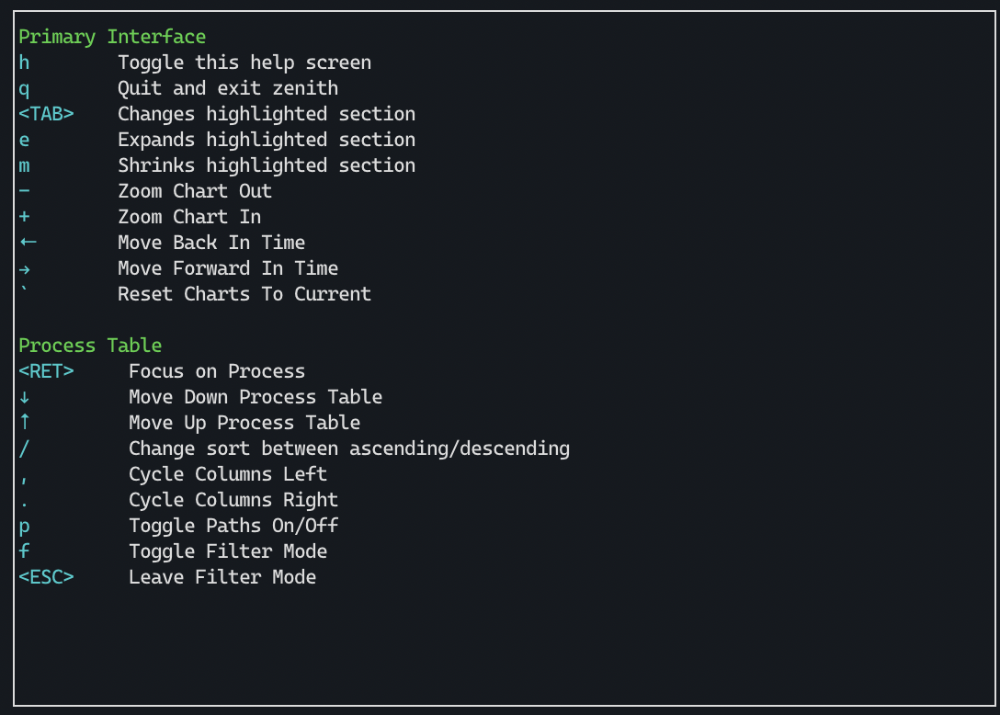

# Zenith 

## In terminal graphical metrics for your *nix system written in Rust


## Features

- Optional CPU, Memory, Network, and Disk usage charts
- Quick glances at Disk free space, NIC IP addresses, CPU frequency
- Highlight top users of CPU, Memory, & Disk
- Battery percentage, time to charge or discharge, power used
- A top-like filterable process table that includes per process disk usage
- Change process priority
- Zoomable chart views (with support to scroll back in time)
- Managing processes with signals
- Performance data saved between runs
- GPU Utilization Metrics for NVIDIA GPUs (with `--features nvidia`)

## Planned Features

- CPU steal percentage and general virtualization awareness
- Sensor Temperature charts
- Per process network usage (Linux)
- Messaging about adverse system events, like errors in kernel ring buffer (Linux)
- Docker support
- ZFS (pool status)
- GPU utilization metrics for AMD GPUS
- Disk metrics like IO ops / latency
- Support Memory pressure

## Current Platforms

- Linux
- MacOS

## Planned Platforms

- BSD (OpenBSD/FreeBSD)
- Perhaps Redox OS.

## Installation

<a href="https://repology.org/project/zenith/versions"></a>

### Binary

Download one of the compiled [releases](https://github.com/bvaisvil/zenith/releases).

### Homebrew

```bash
brew install zenith
```

## Building

This builds under rustc version >= 1.40.0.

```
cd zenith
cargo build --release
```

For NVIDIA GPU support, build with feature `nvidia`:

```cargo build --release --features nvidia```

The minimum supported NVIDIA driver version is 418.56

There is also a Makefile that detects the presence of NVIDIA driver on the
current system and installs both the above flavours on Linux with a wrapper
script to choose the appropriate one at runtime.

```make && sudo make install```

If for some reason the Makefile incorrectly detects NVIDIA driver installation
or in case of a broken installation (e.g. libnvidia-ml.so.1 present but no
    libnvidia-ml.so) then explicitly skip it using the `base` target:

```make base && sudo make install```

The default installation path is `/usr/local` so `make install` requires root
privileges above. To install in a custom location use PREFIX like below:

```make && make install PREFIX=$HOME/zenith```

### Static build

The make file provides for building fully static versions on Linux against the musl C library.
It requires musl-gcc to be installed on the system. Install "musl-tools" package on debian/ubuntu
derivatives, "musl-gcc" on fedora and equivalent on other distributions from their standard repos.

Use the target "linux-static" to build it. This will create a tarball containing the executable
(multiple with wrapper script if NVIDIA has been detected) accompanied with file containing
sha256 sum. The tarball can be extracted anywhere that provies the "zenith" executable.

### Building with NVIDIA support in a virtual environment

If one needs to build with NVIDIA support in a virtual environment, then it requires some more
setup since typically the VM software is unable to directly expose NVIDIA GPU.
Unlike the runtime zenith script, the Makefile has been setup to detect only the presence of
required NVIDIA libraries, so it is possible to build with NVIDIA support even when without
NVIDIA GPU.

Install the nvidia driver package as per the distribution recommended way. For example
in Ubuntu < 18.04 add the NVIDIA PPA (https://launchpad.net/~graphics-drivers/+archive/ubuntu/ppa)
and install the nvidia-430 package. For newer versions install nvidia-driver-440/450 package.

After that disable the actual use of the driver using "sudo prime-select intel". Then while
building with Makefile you will need to explicitly add the NVIDIA library path to LD_LIBRARY_PATH.
For instance on Ubuntu and derivatives, something like:

export LD\_LIBRARY\_PATH=/usr/lib/nvidia-430
make && sudo make install

### Building deb package

Debian package support is present in the source tree. Install devscripts package and use standard
options like "debuild -b -uc -us" to build an unsigned deb package in the directory above.
In a virtual environment build, LD\_LIBRARY\_PATH can be explicitly set like:

debuild -eLD\_LIBRARY\_PATH=/usr/lib/nvidia-430 -b -uc -us

Cargo can be installed from the repositories or the standard rustup way. Latter would be normally
recommended if one needs to do anything more than just building in a virtual environment. For
that case $HOME/.cargo/bin should be in PATH and mark PATH so that debuild does not sanitize it:

debuild -ePATH -eLD\_LIBRARY\_PATH=/usr/lib/nvidia-430 -b -uc -us

Clean up using "./debian/rules clean" rather than "make clean" to clear debian build files too.


## Usage

Running with no arguments starts zenith with the default visualizations for CPU, Disk, and Network and a refresh rate of 2000 ms (2 seconds). These can be changed with command line parameters:

```USAGE:
    zenith [FLAGS] [OPTIONS]

FLAGS:
        --disable-history    Disables history when flag is present
    -h, --help               Prints help information
    -V, --version            Prints version information

OPTIONS:
    -c, --cpu-height <INT>        Height of CPU/Memory visualization. [default: 10]
        --db <STRING>             Database to use, if any. [default: ~/.zenith]
    -d, --disk-height <INT>       Height of Disk visualization. [default: 10]
    -n, --net-height <INT>        Height of Network visualization. [default: 10]
    -p, --process-height <INT>    Min Height of Process Table. [default: 8]
    -r, --refresh-rate <INT>      Refresh rate in milliseconds. [default: 2000]
```


Don't want a section? Remove it by setting the height to 0. 

For example: ```zenith -c 0``` removes the CPU chart.

Up/down arrow keys move around the process table. Return (enter) will focus on a process.
Tab switches the active section. Active sections can be expanded (e) and minimized (m). 
+/- (or =/-) will zoom in / out all of the charts. Arrow keys (←/→) move forward/backward in time.
Back tick (`) resets the chart to current time and max zoom.
Using these options you can create the layout you want.

In zenith 'h' key will show this help:



## Built using these great crates

- [tui-rs](https://github.com/fdehau/tui-rs)
- [sysinfo](https://github.com/GuillaumeGomez/sysinfo)
- [heim](https://github.com/heim-rs/heim)
- [battery](https://github.com/svartalf/rust-battery)
- [serde](https://github.com/serde-rs/serde)
- [gumdrop](https://github.com/murarth/gumdrop)
- [nvml-wrapper](https://github.com/Cldfire/nvml-wrapper)
